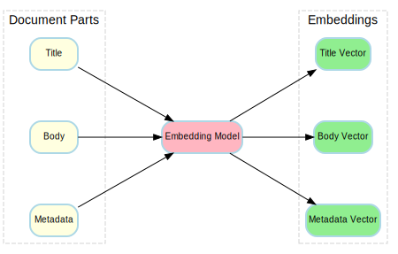
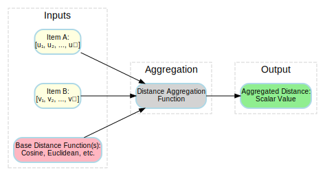

## Multi-Vector HNSW Documentation

### How Does It Work?

Multi-Vector HNSW extends the standard HNSW algorithm to support multiple vectors per indexed item.
Given that each item can have multiple vectors, the main idea is to define a way to compute the distance between two items based on their
vectors.
This is done using a custom distance function that aggregates the distances between corresponding vectors of a pair of items.

The figure below shows an example of how a complex object like a document can be represented by multiple vectors:

<div align="center">
<picture>

</picture>
</div>

The HNSW algorithm is relatively flexible when it comes to distance functions. The main requirement is that the function produces scalar
values that are consistent with the similarity ordering of items. That means if item A is more similar to a query than item B, then the
computed distance from A to the query should be lower than the distance from B. The distance function does not need to be a proper metric (
for example, it can violate the triangle inequality) and does not need to be non-negative. This flexibility makes it possible to plug in
custom distance aggregation strategies (like max, min, weighted average, etc.) without breaking the correctness of HNSW's graph traversal
and search logic.

The figure below shows a high-level overview of how the distance aggregation function works in Multi-Vector HNSW.

<div align="center">
<picture>

</picture>
</div>

### About the HNSW Algorithm

[Hierarchical Navigable Small World (or HNSW)](https://arxiv.org/abs/1603.09320) is an algorithm for approximate nearest neighbor search.
It's designed to find items in a high-dimensional space that are close to a given query point without having to compare the query to every
single item in the dataset. HNSW builds a special graph data structure to make this search process incredibly fast and efficient.

Here's how it works at a high level:

1. **The Graph Structure**: HNSW organizes data points (the vectors) into a multi-layered graph. Each data point exists as a node in this
   graph.
2. **Layers**: The bottom layer (Layer 0) contains *all* the data points. Each subsequent layer above it contains a smaller, sparser subset
   of the points from the layer below. Think of these upper layers as "express lanes" or highways that allow for long-distance traversals
   across the graph.
3. **Insertion**: When a new item is added, it's assigned a random maximum layer (`level`). This `level` is chosen from a probability
   distribution that heavily favors lower layers, ensuring the hierarchy remains balanced. The new node is then inserted into the graph from
   the top layer down to Layer 0. At each layer, it connects to the `M` nearest neighbors it can find.
4. **Search**: A search starts at an entry point in the topmost layer. The algorithm greedily traverses the graph, always moving to the
   neighbor closest to the query vector. Once it can't find a closer neighbor at the current layer, it drops down to the layer below and
   continues the search. This process repeats until it reaches the bottom layer (Layer 0), where a final, more detailed search is performed
   to find the `k` nearest neighbors from a set of candidates.

This layered structure is what makes HNSW so fast. The upper layers quickly navigate to the right region of the graph, and the lower layers
perform the fine-grained search to pinpoint the best matches.

In this library, the implementation is centered around
the [MultiVectorHNSW](../src/main/java/io/github/habedi/mvhnsw/index/MultiVectorHNSW.java) class, which manages the graph nodes, vector
storage, and concurrency control using a `ReentrantReadWriteLock` to allow for safe, parallel search operations.

### Index Parameters and Tuning

The performance and accuracy of the HNSW index are controlled by several parameters.
Finding the right balance between **build time**, **search time**, and **recall** is key to getting the results you need.

#### Build-Time Parameters

These are set when creating the index using the builder.

* `withM(int m)`

    * **What it is:** The maximum number of connections (or neighbors) each node will have per layer in the graph.
    * **Impact:** A higher `M` creates a denser graph. This generally improves search accuracy (recall) but also increases the index build
      time and memory usage.
    * **Typical Values:** A good range is between `5` and `48`; default is `16`.

* `withEfConstruction(int efConstruction)`

    * **What it is:** The size of the dynamic candidate list used during index construction. When adding a new node, the algorithm keeps
      track of the `efConstruction` best candidates found so far to select the final `M` connections from.
    * **Impact:** A larger `efConstruction` leads to a higher-quality index with better search recall, but it significantly slows down the
      indexing process. This value should always be larger than `M`.
    * **Typical Values:** A good range is between `64` and `512`; default is `200`.

#### Search-Time Parameter

This is set during each search operation.

* `efSearch` (in `search(query, k, efSearch)`)
    * **What it is:** The size of the dynamic candidate list used during a search.
    * **Impact:** This is the most important parameter for tuning the search-time trade-off between speed and accuracy. A larger `efSearch`
      value will result in higher recall at the cost of a slower query. It must be greater than or equal to `k` (the number of neighbors you
      want).
    * **Typical Values:** Depends on the desired recall, but often ranges from `k` to `500` or higher.

### Supported Distance Functions

At the moment, Multi-Vector HNSW supports the following distance functions out of the box:

| \# | Distance Function                                                                            | Formula (for vectors A, B)        | Range   | Description                                 |
|----|----------------------------------------------------------------------------------------------|-----------------------------------|---------|---------------------------------------------|
| 1  | [Cosine](../src/main/java/io/github/habedi/mvhnsw/distance/Cosine.java)                      | $1 - \frac{A \cdot B}{            | A       | \cdot                                       |B|}$ | [0, 2]  | One minus cosine similarity                 |
| 2  | [Squared Euclidean](../src/main/java/io/github/habedi/mvhnsw/distance/SquaredEuclidean.java) | $\sum_i (A_i - B_i)^2$            | [0, ∞)  | The squared value of the Euclidean distance |
| 3  | [Dot Product](../src/main/java/io/github/habedi/mvhnsw/distance/DotProduct.java)             | $- (A \cdot B) = -\sum_i A_i B_i$ | [-∞, ∞] | The negative of the dot product             |

> [\!NOTE]
> Squared Euclidean distance gives the same ordering as standard Euclidean distance, but it's faster to compute.
> If you specifically need the Euclidean distance, it's easy to implement, but in most cases, the squared version is a better choice.

### Adding New Distances

It's very easy to extend the library's functionality with new distances. To do that, you need to implement two interfaces:

1. [Distance<FloatVector>](../src/main/java/io/github/habedi/mvhnsw/distance/Distance.java): Represents a distance between a pair of
   vectors (see [Cosine.java](../src/main/java/io/github/habedi/mvhnsw/distance/Cosine.java) for an example).
2. [MultiVectorDistance](../src/main/java/io/github/habedi/mvhnsw/distance/MultiVectorDistance.java): Represents the aggregated distance
   between two lists of vectors (
   see [WeightedAverageDistance.java](../src/main/java/io/github/habedi/mvhnsw/distance/WeightedAverageDistance.java) for an example
   implementation).

To add new functionality, you just need to create new classes that implement these interfaces. The HNSW builder can accept any class that
conforms to the [MultiVectorDistance](../src/main/java/io/github/habedi/mvhnsw/distance/MultiVectorDistance.java) interface.

#### Example: Adding Manhattan and Min-Distance

Here is a complete, runnable example that demonstrates how to add a new `Manhattan` distance and a new `MinDistance` aggregation strategy.

##### 1\. Implement `Manhattan` Distance

First, create a `Manhattan.java` class in your own project that implements the `Distance<FloatVector>` interface.
This calculates the sum of absolute differences between vector components.

```java
package your.own.pkg; // Use your own package name

import io.github.habedi.mvhnsw.common.FloatVector;
import io.github.habedi.mvhnsw.distance.Distance;

import java.io.Serial;
import java.io.Serializable;

public class Manhattan implements Distance<FloatVector>, Serializable {

    @Serial
    private static final long serialVersionUID = 1L;

    @Override
    public double compute(FloatVector a, FloatVector b) {
        if (a.length() != b.length()) {
            throw new IllegalArgumentException("Vector lengths must be equal.");
        }
        double sum = 0.0;
        for (int i = 0; i < a.length(); i++) {
            sum += Math.abs(a.getPrimitive(i) - b.getPrimitive(i));
        }
        return sum;
    }

    @Override
    public String getName() {
        return "Manhattan";
    }
}
```

##### 2\. Implement `MinDistance` (Aggregated) Distance

Next, create a `MinDistance.java` class that implements the `MultiVectorDistance` interface. Instead of a weighted average, this class will
find the *minimum* distance among all vector pairs.

```java
package your.own.pkg; // Use your own package name

import io.github.habedi.mvhnsw.common.FloatVector;
import io.github.habedi.mvhnsw.distance.Distance;
import io.github.habedi.mvhnsw.distance.MultiVectorDistance;

import java.io.Serial;
import java.io.Serializable;
import java.util.List;
import java.util.Objects;

public class MinDistance implements MultiVectorDistance, Serializable {

    @Serial
    private static final long serialVersionUID = 1L;
    private final Distance<FloatVector> baseDistance;

    public MinDistance(Distance<FloatVector> baseDistance) {
        this.baseDistance = Objects.requireNonNull(baseDistance, "Base distance cannot be null.");
    }

    @Override
    public double compute(List<FloatVector> vectors1, List<FloatVector> vectors2) {
        if (vectors1.size() != vectors2.size() || vectors1.isEmpty()) {
            throw new IllegalArgumentException("Vector lists must be non-empty and of equal size.");
        }
        double minDistance = Double.MAX_VALUE;
        for (int i = 0; i < vectors1.size(); i++) {
            double dist = baseDistance.compute(vectors1.get(i), vectors2.get(i));
            if (dist < minDistance) {
                minDistance = dist;
            }
        }
        return minDistance;
    }
}
```

##### 3\. Put Everything Together

Now you can use these new, custom classes to build an index and perform searches with the new distance functions.

```java
import io.github.habedi.mvhnsw.common.FloatVector;
import io.github.habedi.mvhnsw.index.Index;
import io.github.habedi.mvhnsw.index.MultiVectorHNSW;
import io.github.habedi.mvhnsw.index.SearchResult;

// Import the custom distance classes you just created.
// The package `your.own.pkg` should be replaced with your actual package name.
import your.own.pkg.Manhattan;
import your.own.pkg.MinDistance;

import java.util.List;

public class ExtensibilityExample {
    public static void main(String[] args) {

        // 1. Create an instance of our new "MinDistance" aggregation,
        //    using Manhattan as its base distance.
        var minManhattanDistance = new MinDistance(new Manhattan());

        // 2. Pass the custom distance function directly to the builder.
        Index index = MultiVectorHNSW.builder()
            .withM(16)
            .withEfConstruction(200)
            .withDistance(minManhattanDistance) // Use the generic `withDistance` method
            .build();

        // 3. Add and search data as usual.
        index.add(1L, List.of(FloatVector.of(1f, 2f), FloatVector.of(10f, 10f)));
        index.add(2L, List.of(FloatVector.of(8f, 8f), FloatVector.of(1f, 3f)));

        List<FloatVector> query = List.of(FloatVector.of(2f, 2f), FloatVector.of(9f, 9f));
        // Note the third parameter `efSearch`, which controls search accuracy.
        List<SearchResult> results = index.search(query, 1, 10);

        // The distance for item 1 is min(|1-2|+|2-2|, |10-9|+|10-9|) = min(1, 2) = 1
        // The distance for item 2 is min(|8-2|+|8-2|, |1-9|+|3-9|) = min(12, 14) = 12
        // So, item 1 should be the closest.
        System.out.println("Search results:");
        results.forEach(System.out::println);
    }
}
```
